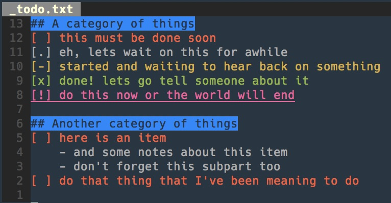

# todo-vim

A simple syntax highlighting plugin for vim.



## Using

File must be called `todo.md`, `TODO.md`, `_todo.md`, or `_TODO.md` for the plugin to automatically activate. Use syntax as seen in the screenshot above.  Only syntax highlighting is modified with this plugin; indentation and other actions from regular vim markdown mode are still active.

## Installation

#### Vundle:

```bash
# near the top of your .vimrc
Plugin 'cole-brokamp/vim-todo'
```

#### Manual installation:

```bash
$ git clone https://github.com/cole-brokamp/vim-todo
$ cd vim-todo
$ make install
```
